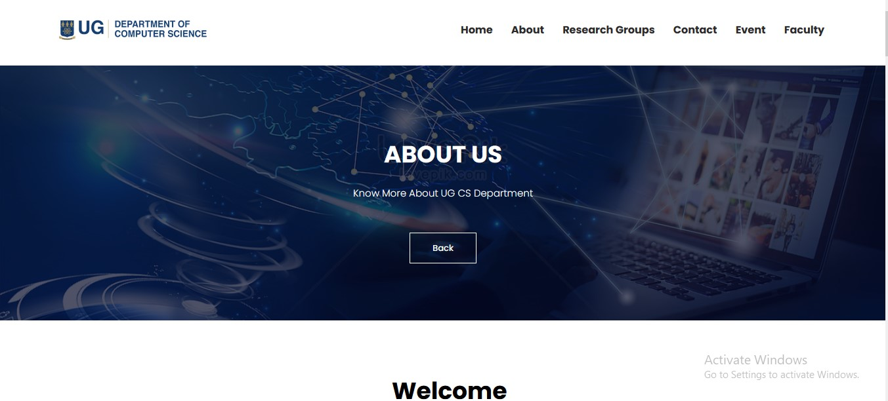

# DCIT_205_IA

# INTRODUCTION

Welcome to the UG Computer Science Department website! This website serves as a platform to provide information about the department's programs, faculty, courses, contact details. events and other relevant details. It was developed using HTML, CSS, and JavaScript.

#
## Table of Contents:

- Cloning and Setup 

- Author Information

- Screenshots

- Project Learnings

- Cloning and Setup

- Prerequisites:
#
# **Clone the Repository:**
_bash
Copy code
git clone https://github.com/your-username/DCIT_205_IA.git
Navigate to the Project Directory:_

- _bash_
- _Copy code_
- _cd DCIT_205_IA_
- _Open the Main Page:_
- _Open the index.html file in your preferred web browser._
#
# Author Information 
### _*Name: Anthony Afful Broni*_

### _*Student ID: 11313275*_
#

# Screenshots Of Pages Of The Website
### Navigation Bar/Header

#

### Home Page
 

#

## Footer

Caption for Home Page.

#

## About Page

Caption for Courses Page.
##

## Research Page

Caption for Faculty Page.
#

## Contact Page

Caption for Faculty Page.
#

## Event Page

Caption for Faculty Page.
#

## Faculty Page

Caption for Faculty Page.
#

## Courses Page

#

# Project Learnings
During the development of the Computer Science Department website, I learned:

HTML Fundamentals:
Creating structured and semantically meaningful web pages.
CSS Styling:

Styling web pages to enhance the user interface and experience.
JavaScript Interactivity:

Implementing interactive features to improve user engagement.
Responsive Design:

Ensuring the website looks good and functions well across various devices.
Project Organization:

Structuring a web project with clear separation of concerns.
Version Control:

Using Git for version control and collaboration.
Challenges Faced:
Describe any challenges faced during the development process and how they were overcome.

## Technologies Used:
HTML
CSS and
JavaScript

Feel free to reach out at anthonyaffulkwabenabroni@gmail.com for any inquiries or feedback. Thank you for exploring the Computer Science Department website!