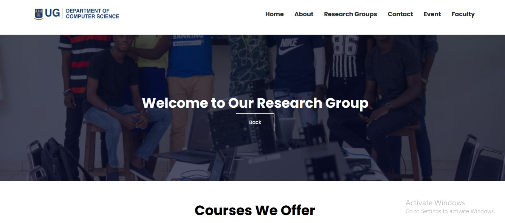

# DCIT_205_IA

# INTRODUCTION

Welcome to the UG Computer Science Department website! This website serves as a platform to provide information about the department's programs, faculty, courses, contact details. events and other relevant details. It was developed using HTML, CSS, and JavaScript.

#
## Table of Contents:

- Cloning and Setup 

- Author Information

- Screenshots

- Project Learnings

- Cloning and Setup

- Prerequisites:
#
# **Clone the Repository:**
_bash
Copy code
git clone https://github.com/your-username/DCIT_205_IA.git
Navigate to the Project Directory:_

- _bash_
- _Copy code_
- _cd DCIT_205_IA_
- _Open the Main Page:_
- _Open the index.html file in your preferred web browser._
#
# Author Information 
### _*Name: Anthony Afful Broni*_

### _*Student ID: 11313275*_
#

# Screenshots Of Pages Of The Website
### Navigation Bar/Header

#

### Home Page
 

The Home page serve as the main entry point to a website, offering a snapshot of its content and navigation. It provides a welcoming interface, often featuring key information, updates, or featured content, to guide visitors through the site.
#

## Footer

The footer on a webpage provide essential navigation links, contact information, and additional details that remain consistent across pages. It enhances user experience by offering quick access to key information and reinforcing the website's structure and branding.
#

## About Page

The About page is to provide concise information about the website, its creators, or the organization behind it. It establishes credibility, shares the mission or values, and helps visitors connect with the people or purpose behind the content and help to get to know more about us.
##

## Research Page

The research group page is to showcase the expertise, ongoing projects, and publications of the research group. It serves as a hub for visitors to learn about the group's focus areas, team members, and contributions to the field.
#

## Contact Page

My contact page contains information and features that allow visitors to get in touch with the website's owner, administrators, or support team. 
Here are some of the common component my website contain Forms, Details, Department Contact and Map.
#

## Event Page

The event page on this website serves to promote and centralize information about upcoming events. It provides details, encourages engagement, facilitates registrations, and acts as a hub for updates and media sharing. The page contributes to SEO, supports brand building, and enhances accessibility, making it a vital tool for effectively communicating and managing events online.
#

## Faculty Page

The faculty page is to introduce and provide information about the academic staff, their expertise, research interests, and contact details. It serves as a resource for students, researchers, and visitors seeking to learn more about the faculty members in the computer science department.
#

## Courses Page

on the courses page each page(undergraduate,phd, and MsC & Mphil) have the same format but different course code and titles.
#

# Project Learnings
During the development of the Computer Science Department website, I learned:

>HTML Fundamentals:
Creating structured and semantically meaningful web pages.

>CSS Styling:
Styling web pages to enhance the user interface and experience.

>JavaScript Interactivity:
Implementing interactive features to improve user engagement.

>Responsive Design:
Ensuring the website looks good and functions well across various devices.

>Project Organization:
Structuring a web project with clear separation of concerns.

>Version Control:
Using Git for version control and collaboration.

## Challenges Faced:
Some of thechallenges in developing the computer science department website include ensuring responsive design for various devices, addressing browser compatibility issues through testing, managing dynamic content with JavaScript frameworks, optimizing user experience through design and interactive elements. 

## Solutions to the challenges
 My solution involve implementing responsive design techniques, using cross-browser compatibility libraries, employing JavaScript frameworks, conducting user testing, optimizing asset loading for improved performance, Watching videos on youTube asking for help from Mr. Daquiver and Raymond.

## Technologies Used:
HTML
CSS and
JavaScript

Feel free to reach out at anthonyaffulkwabenabroni@gmail.com for any inquiries or feedback. Thank you for exploring the Computer Science Department website!